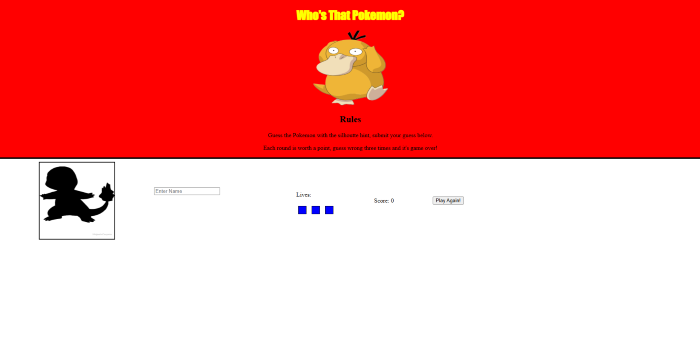

# Guess Pokemon Fan App

A web-based game where players guess Pokemon based on silhouettes.

## Overview

This fun and interactive game challenges players to identify Pokemon based on their silhouettes. Test your Pokemon knowledge by guessing correctly and earning points. You have a limited number of lives, so choose wisely!

## Goals

- Create an engaging Pokemon guessing game
- Implement game logic with JavaScript
- Practice DOM manipulation
- Build a responsive and user-friendly interface
- Demonstrate object-oriented programming principles

## Technologies Used

- JavaScript (ES6+)
- HTML5
- CSS3
- Pokemon API/dataset
- Object-oriented programming

## Features

- Pokemon silhouette guessing gameplay
- Score tracking
- Lives system
- Pokemon image reveals
- Responsive design

## Getting Started

1. Clone the repository
2. Open `index.html` in your browser
3. Start guessing Pokemon!

## How to Play

1. A silhouette of a Pokemon will appear
2. Type your guess in the input field and press Enter
3. If correct, you earn a point and see the actual Pokemon
4. If wrong, you lose a life
5. Game ends when you run out of lives

## Author

[Juan Ceballos](https://github.com/Juan-Ceballos)
